# Parsing Nginx Logs


Nginx access logs provide valuable insights into website traffic, user behavior, and server performance. To parse these logs effectively, you’ll need to extract relevant information and transform it into a usable format.

This program has tried to check the nginx log from different angles and give you a complete view.

Information extracted from the `logfile`(Access.log) or `docker container` log

- The date range of the log file (the analyzed logs are related to what da.te range).

- IPs 
- URLs 
- Browser 
- Status Code
- Unknown Agent
- Referer
- Country
- Timezone
- Filters: can be created on any of the following items and the above 
information can be received according to the filters
- `Export` Data as `TXT` or `SCV`


### requirement

  - [Python 3.x](https://www.python.org/)

in current directory run this command for install python Requirement package

```sh
pip install requirements.txt
```  

### Attention

To get the correct information, make sure that the **date and time** of the server are correct.

If you run `Nginx` in a container such as **Docker**, the container's time are completely independent from the server and must be set separately and are generally UTC.
 

## RUN

```bash
git clone https://github.com/beigi-reza/ParsingNginxLogs.git
```
```bash
cd ParsingNginxLogs
./main.py
```

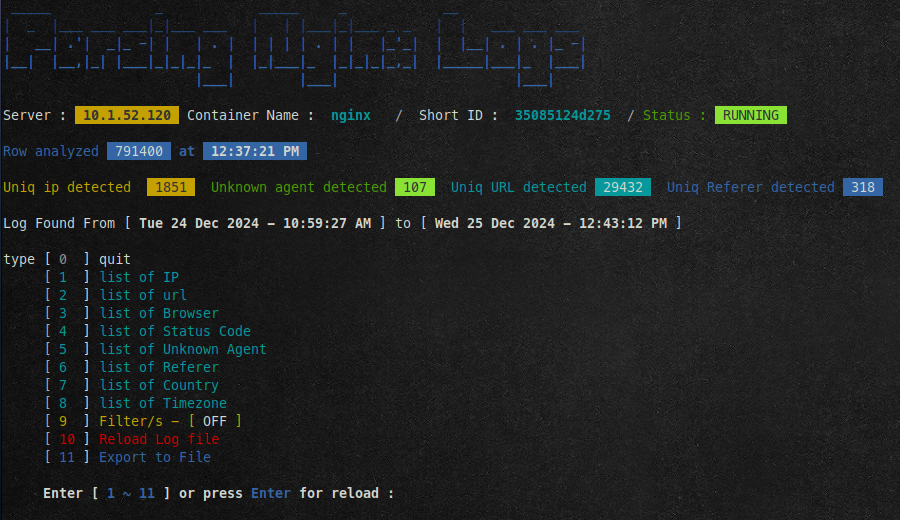


## Filters

Filters can be created on one or all of the following items. These filters affect all reports, and reports are prepared again with the effect of these filters.

If multiple filters are selected, the relationship between them will be **`and`**

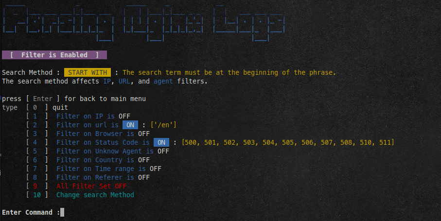

### Filter by IP

Filter on a IP or part of IP

example

- `82.79.160.29`  All requests from an IP
- `66.249.64`  All requests from the IP range
- `66.249`  All requests from the IP range
- `212` All requests from the IP range

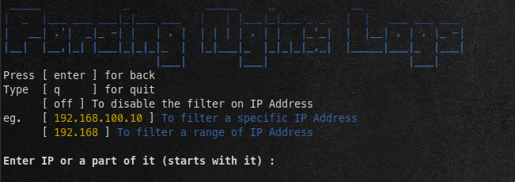

### Filter by URL

Filter on requests that have gone to a specific URL

- `/`  All Request For Home
- `/en`  All Request for url **/en**
- `/js/jsbase.min.js` All Request for url **/js/jsbase.min.js**

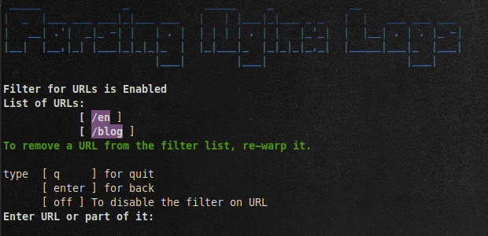

### Filter by Browser

Filter on requests received from one or more browsers

- `[Chrome]` All Request from browser **Chrome**
- `[Firefox,Safari]` All Request from browser **Firefox** and **Safari**

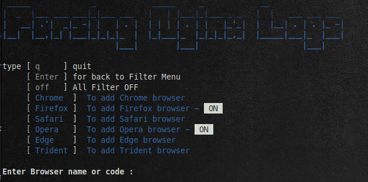

### Filter by Status Code

type Status Code or select a Grpup of status code


- `404`: for status code 400
- `4x`: For all Cleient error code


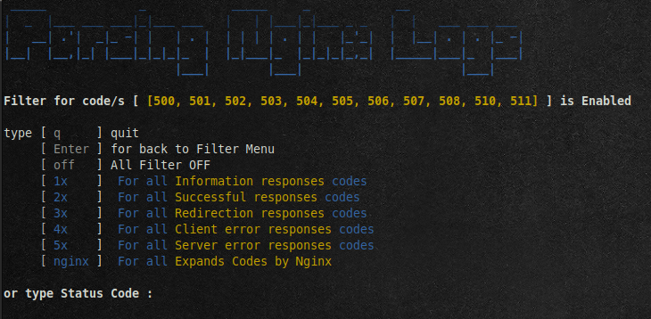

### Filter by Unknow Agent

Filter requests by browser or agent was unknown based on the name or description of the agent.

- `facebookexternalhit` All Request from agent  **facebookexternalhit**
- `Clarity-Bot` All Request from agent  **Clarity-Bot**
- `yandex.com` All Request from **yandex Bot**

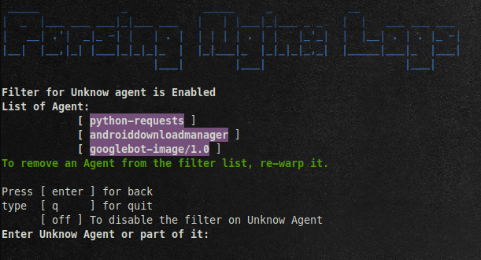


### Filter by Country

type Country name or part of it

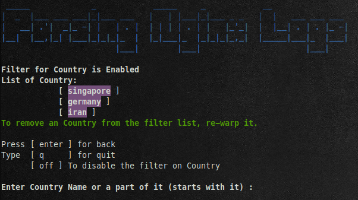


### Filter by Time range

Filter information based on date range.

You can specify the range of receiving the report to a time range


- `5` for 5 minutes past
- `15m` for 15 minutes past
- `25s` for 25 seconds past
- `2h` for 2 hours past
- `3d` for 3 Days past
- `1w` for 1 Week past

If the entered date range is greater than the date range of the log file, the entire log file will be parsing

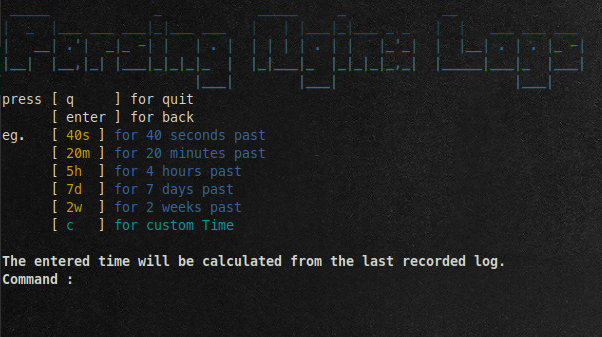


### Search Method

- **`start`**   
- **`end`**     
- **`all`**     
- **`exactly`**

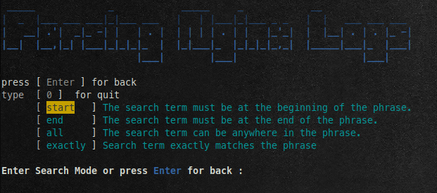

## Export

The Extracted Data can be saved in `Text` and `CSV` file formats

- Filters will affect all Exported Reports
- **Summary Report** Exported as Text File and
- **Summary Report** It is a summary of all information And the `Max_Line` parameter value is effective in it
- Other Report Exported as `CSV` and the value of the `Max_Line` parameter does not affect it, and all information is stored in the file 

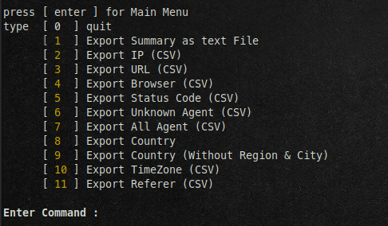